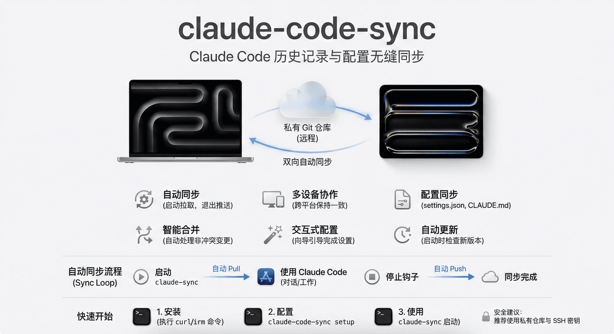

# claude-code-sync

[](https://github.com/osen77/claude-code-sync-cn/actions/workflows/release-new.yml)

一个用于同步 Claude Code 对话历史的 Rust CLI 工具，支持跨设备备份和自动同步。



## 功能特性

- **自动同步** - 启动时自动拉取，退出时自动推送，无需手动操作
- **多设备同步** - 在不同电脑间保持对话历史一致
- **配置同步** - 同步 settings.json、CLAUDE.md 等配置文件，支持跨平台适配
- **跨 Agent 查询** - `ccs session` 可同时查询 Claude Code 与 Codex 历史会话
- **智能合并** - 自动合并非冲突的对话变更
- **交互式配置** - 首次运行向导引导完成所有配置
- **自动更新** - 启动时检查新版本，支持一键更新

## 快速开始

### 安装

**一键安装（推荐）：**

```bash
# macOS Apple Silicon (M1/M2/M3/M4)
curl -fsSL https://github.com/osen77/claude-code-sync-cn/releases/latest/download/ccs-macos-aarch64.tar.gz | tar xz && sudo mv ccs /usr/local/bin/

# macOS Intel
curl -fsSL https://github.com/osen77/claude-code-sync-cn/releases/latest/download/ccs-macos-x86_64.tar.gz | tar xz && sudo mv ccs /usr/local/bin/

# Linux x86_64
curl -fsSL https://github.com/osen77/claude-code-sync-cn/releases/latest/download/ccs-linux-x86_64.tar.gz | tar xz && sudo mv ccs /usr/local/bin/
```

**其他安装方式：**

```bash
# 安装脚本（自动检测平台）
curl -fsSL https://raw.githubusercontent.com/osen77/claude-code-sync-cn/main/install.sh | bash

# Windows PowerShell
irm https://raw.githubusercontent.com/osen77/claude-code-sync-cn/main/install.ps1 | iex

# 从源码编译
git clone https://github.com/osen77/claude-code-sync-cn && cd claude-code-sync && cargo install --path .
```

### 更新

```bash
# 自动更新
ccs update

# 或使用安装命令重新下载覆盖（适用于旧版本无 update 命令的情况）
curl -fsSL https://github.com/osen77/claude-code-sync-cn/releases/latest/download/ccs-macos-aarch64.tar.gz | tar xz && sudo mv ccs $(which ccs)
```

### 配置

```bash
ccs setup
```

向导会引导你完成所有配置，包括：
1. 选择同步模式（多设备 / 单设备）
2. 配置远程仓库（已有仓库或自动创建）
3. 设置过滤选项（排除附件、旧对话）
4. 配置自动同步（推荐）
5. 配置跨设备配置同步

### 使用

配置完成后，使用 `claude-sync` 启动 Claude Code 即可自动同步：

```bash
claude-sync
```

### 卸载

```bash
ccs uninstall
```

## 文档

📚 **[用户指南](docs/user-guide.md)** - 完整的安装配置、多设备同步、常用命令和故障排查

📚 **[开发者指南](CLAUDE.md)** - 项目架构、开发规范和贡献指南

## 常用命令

| 命令 | 说明 |
|------|------|
| `ccs setup` | 交互式配置向导 |
| `ccs sync` | 双向同步 |
| `ccs automate` | 配置自动同步 |
| `ccs status` | 查看同步状态 |
| `ccs session` | 会话管理 |
| `ccs session search <关键词>` | 跨 Claude Code / Codex 搜索历史会话 |
| `ccs session overview --since 7d` | 查看最近项目会话概览 |
| `ccs config-sync push` | 推送配置到远程 |
| `ccs config-sync apply <device>` | 应用其他设备配置 |
| `ccs update` | 更新到最新版本 |
| `ccs uninstall` | 卸载并清理所有数据 |

更多命令请参阅 [用户指南](docs/user-guide.md)。

## 会话查询

`ccs session` 默认会同时查询两个来源：

- `CC` - Claude Code，会话文件来自 `~/.claude/projects/`
- `CX` - Codex，会话文件来自 `~/.codex/sessions/`

常用示例：

```bash
# 跨 Agent 搜索
ccs session search "关键词" -n 5

# 只搜索 Codex
ccs session search "关键词" --source codex -n 5

# 查看 Codex 会话列表
ccs session list --source codex --show-ids

# 查看最近 7 天概览
ccs session overview --since 7d --recent 5

# 查看某个 Codex 会话详情
ccs session show <session-id> --source codex --tail 10
```

`--source` 支持 `all`、`claude`、`codex`，默认是 `all`。`--since` 支持 `30m`、`24h`、`7d`、`2w`。

### AI Agent 系统提示词参考

在 `CLAUDE.md` 等系统提示词中添加以下内容，让 Agent 自主检索历史对话：

```markdown
## 跨会话上下文检索

需要回忆历史或查找其他项目实现时，用 `ccs session` 检索 Claude Code / Codex 历史（各参数详见 `--help`）。
典型流程：`overview` 速览全貌 → `search` 找 session_id → `show --around/--tail` 钻取上下文。

ccs session overview --json --since 7d                          # 速览最近 7 天项目动态
ccs session search "<关键词>" -p <项目名> --json                # 搜索特定项目的实现
ccs session show <session_id> --around "<关键词>" -n 5 --json  # 钻取匹配位置上下文
```

## 工作原理

Claude Code 将对话历史存储在 `~/.claude/projects/` 目录下的 JSONL 文件中。

Codex 历史会话以只读方式从 `~/.codex/sessions/` 读取，用于 `session list/search/show/overview`。同步和写操作仍只针对 Claude Code 历史。

`ccs` 的工作流程：
1. 发现本地 Claude Code 历史中的所有对话文件
2. 复制到 Git 仓库并推送到远程
3. 拉取时，合并远程变更到本地历史
4. 冲突时保留两个版本，生成冲突报告

## 自动同步流程

```
启动时: claude-sync → 自动 pull → 启动 Claude Code
使用中: 检测新项目 → 自动 pull 该项目历史
每轮对话结束: Stop Hook → 自动 push
```

## 配置同步

除了对话历史，还支持跨设备同步 Claude Code 配置：

```bash
# 推送当前配置
ccs config-sync push

# 查看可用设备
ccs config-sync list

# 应用其他设备配置
ccs config-sync apply MacBook-Pro
```

**同步内容**：
- `settings.json` - 权限、模型配置（自动过滤 hooks）
- `CLAUDE.md` - 用户全局指令（支持平台标签过滤）
- `installed_skills.json` - 已安装的 skills 列表

**平台标签**：CLAUDE.md 支持平台特定内容，跨平台应用时自动过滤

```markdown
<!-- platform:macos -->
macOS 专用配置
<!-- end-platform -->
```

详见 [用户指南 - 配置同步](docs/user-guide.md#配置同步)。

## 安全考虑

- 对话历史可能包含敏感信息
- 建议使用私有 Git 仓库
- 推荐使用 SSH 密钥或访问令牌进行认证

## 相关资源

- **中文仓库**: https://github.com/osen77/claude-code-sync-cn
- **上游项目**: https://github.com/perfectra1n/claude-code-sync
- **问题追踪**: https://github.com/osen77/claude-code-sync-cn/issues

## 贡献

欢迎贡献！请 Fork 仓库，创建功能分支，提交 Pull Request。

---

*最后更新: 2026-03-26*
