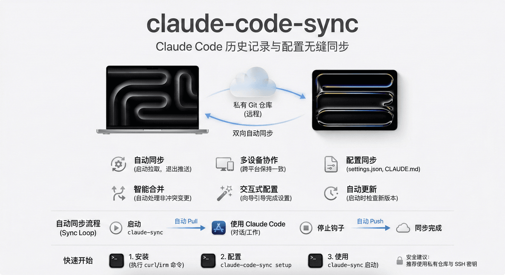

# claude-code-sync

[](https://github.com/osen77/claude-code-sync-cn/actions/workflows/release-new.yml)

一个用于同步 Claude Code 对话历史的 Rust CLI 工具，支持跨设备备份和自动同步。



## 功能特性

- **自动同步** - 启动时自动拉取，退出时自动推送，无需手动操作
- **多设备同步** - 在不同电脑间保持对话历史一致
- **配置同步** - 同步 settings.json、CLAUDE.md 等配置文件，支持跨平台适配
- **跨 Agent 查询** - `ccs session` 可同时查询 Claude Code、Codex 与 OMP 历史会话
- **智能合并** - 自动合并非冲突的对话变更
- **交互式配置** - 首次运行向导引导完成所有配置
- **自动更新** - 启动时检查新版本，支持一键更新

## 快速开始

### 安装

**一键安装（推荐）：**

```bash
# macOS Apple Silicon (M1/M2/M3/M4)
curl -fsSL https://github.com/osen77/claude-code-sync-cn/releases/latest/download/ccs-macos-aarch64.tar.gz | tar xz && sudo mv ccs /usr/local/bin/

# macOS Intel
curl -fsSL https://github.com/osen77/claude-code-sync-cn/releases/latest/download/ccs-macos-x86_64.tar.gz | tar xz && sudo mv ccs /usr/local/bin/

# Linux x86_64
curl -fsSL https://github.com/osen77/claude-code-sync-cn/releases/latest/download/ccs-linux-x86_64.tar.gz | tar xz && sudo mv ccs /usr/local/bin/
```

**其他安装方式：**

```bash
# 安装脚本（自动检测平台）
curl -fsSL https://raw.githubusercontent.com/osen77/claude-code-sync-cn/main/install.sh | bash

# Windows PowerShell
irm https://raw.githubusercontent.com/osen77/claude-code-sync-cn/main/install.ps1 | iex

# 从源码编译
git clone https://github.com/osen77/claude-code-sync-cn && cd claude-code-sync && cargo install --path .
```

### 更新

```bash
# 自动更新
ccs update

# 或使用安装命令重新下载覆盖（适用于旧版本无 update 命令的情况）
curl -fsSL https://github.com/osen77/claude-code-sync-cn/releases/latest/download/ccs-macos-aarch64.tar.gz | tar xz && sudo mv ccs $(which ccs)
```

### 配置

```bash
ccs setup
```

向导会引导你完成所有配置，包括：
1. 选择同步模式（多设备 / 单设备）
2. 配置远程仓库（已有仓库或自动创建）
3. 设置过滤选项（排除附件、旧对话）
4. 配置自动同步（推荐）
5. 配置跨设备配置同步

### 使用

配置完成后，使用 `claude-sync` 启动 Claude Code 即可自动同步：

```bash
claude-sync
```

### 卸载

```bash
ccs uninstall
```

## 日志排查

`ccs` 默认把日志写到 stderr，并同时写入平台配置目录中的日志文件。需要临时提高可见性或收集一次运行时，可使用：

```bash
# 临时开启 console 和 file 的 DEBUG 日志
ccs --debug session list

# 将本次运行的日志写入指定文件
ccs --log-file ./ccs-debug.log session search "keyword"

# 只在 console 显示错误；file 仍按默认级别记录
RUST_LOG=error ccs session list
```

默认日志文件路径：

- macOS：`~/Library/Application Support/claude-code-sync/claude-code-sync.log`
- Linux：`~/.config/claude-code-sync/claude-code-sync.log`（设置 `XDG_CONFIG_HOME` 时位于 `$XDG_CONFIG_HOME/claude-code-sync/claude-code-sync.log`）
- Windows：`%APPDATA%\\claude-code-sync\\claude-code-sync.log`

每次 ccs 初始化文件 logger 时都会检查日志大小；超过 10 MiB 会在下一次 ccs 调用打开日志时轮转，最多保留 3 代备份。`RUST_LOG=off` 只关闭 console 输出，不会关闭 file sink。日志包含每次运行的 `invocation=I-...`，便于关联同一次运行。系统会自动脱敏常见 token/password/secret/API key、Authorization、URL userinfo，以及完整的 `file://` URI path（包括 hosted URI path 中合法的逗号、引号、`]`、`)` 等字符），不主动记录会话正文；建议不要把其他未识别的敏感内容放进 CLI 参数或日志消息。每次 file write/flush 都重新获取同一 per-log lock，并以 no-follow 方式打开 current；rotation staging 从已打开的 no-follow handle 复制，并在 live rename 前复核 inode/metadata，因此长生命周期进程不会持有轮转前的旧 inode。轮转失败会回滚；若 rollback 自身失败，transaction 目录不会被自动删除，并返回可见的安全错误，便于恢复旧日志。

该锁是 `ccs` 进程之间的 advisory lock，只约束同样取得 `.lock` 文件锁的协作方。系统 `logrotate`、用户脚本或其他直接对日志路径执行 rename/copy/append 的程序若不遵守该协议，无法承诺与 ccs rotation 原子协调；不要把“外部 rotation 测试通过”理解为所有外部 rotator 都受保护。

## 文档

📚 **[用户指南](docs/user-guide.md)** - 完整的安装配置、多设备同步、常用命令和故障排查

📚 **[开发者指南](CLAUDE.md)** - 项目架构、开发规范和贡献指南

## 常用命令

| 命令 | 说明 |
|------|------|
| `ccs setup` | 交互式配置向导 |
| `ccs sync` | 双向同步 |
| `ccs automate` | 配置自动同步 |
| `ccs status` | 查看同步状态 |
| `ccs session` | 会话管理（含误删保护与恢复） |
| `ccs session search <关键词>` | 跨 Claude Code / Codex / OMP 搜索历史会话 |
| `ccs session overview --since 7d` | 查看最近项目会话概览 |
| `ccs session restore` | 恢复被意外删除的会话 |
| `ccs config-sync push` | 推送配置到远程 |
| `ccs config-sync apply <device>` | 应用其他设备配置 |
| `ccs update` | 更新到最新版本 |
| `ccs uninstall` | 卸载并清理所有数据 |

更多命令请参阅 [用户指南](docs/user-guide.md)。

## 会话查询

`ccs session` 默认会同时查询三个来源：

- `CC` - Claude Code，会话文件来自 `~/.claude/projects/`
- `CX` - Codex，会话文件来自 `~/.codex/sessions/`
- `OM` - OMP，会话文件来自 `~/.omp/agent/sessions/`

来源能力矩阵：

| 来源 | 查询 | 打开 | 重命名 | 删除 | 参与同步 |
|------|------|------|--------|------|----------|
| Claude Code | ✅ | ✅ | ✅ | ✅ | ✅ |
| Codex | ✅ | ❌ | ❌ | ❌ | ❌ |
| OMP | ✅ | ✅ | ❌ | ❌ | ❌ |

常用示例：

```bash
# 跨来源搜索
ccs session search "关键词" -n 5

# 只查询 Codex
ccs session --source codex list
ccs session list --source codex   # 等价

# 查看某个 OMP 会话详情
ccs session --source omp show <session-id>

# 查看最近 7 天概览
ccs session overview --since 7d --recent 5
```

`--source` 支持 `all`、`claude`、`codex`、`omp`，默认是 `all`。Codex 和 OMP 是只读来源；OMP 会话可以从交互菜单打开原始会话，但不能通过 `ccs` 重命名或删除。重命名和删除只对 Claude Code 会话生效。

当多个来源存在相同的 session ID 时，`show`、`rename` 和 `delete` 不会静默选择其中一个，而是列出候选并要求使用 `--source` 消歧。`--since` 支持 `30m`、`24h`、`7d`、`2w`。

### 会话扫描诊断

正常扫描保持安静，不会因为扫描结果完整而额外输出提示。如果某些文件损坏、无权读取，或 session index cache 读写失败，`ccs` 会尽量保留其余结果，并在文本命令的 stderr 输出**一条聚合的 degraded warning**；逐条扫描诊断只写入文件日志，不会污染业务输出。Claude projects 根目录的 `read_dir` 失败也按 best-effort 处理：该来源记为 I/O degraded，但不会阻断 Codex/OMP 扫描或已经取得的结果。warning 中只包含稳定的 `path_hash` 和受控摘要，不包含完整路径、会话正文、原始错误内容或 cache 原始路径/错误；cache 诊断细节仅写入文件日志。

`session overview --json`、`session search --json` 和 `session show --json` 的业务 JSON 顶层会增加 `schema_version: 1` 与 `diagnostics`。其中 `diagnostics.diagnostic_id` 是本次扫描的关联 ID；它与同一次运行文件日志中的 `invocation=I-...` 使用同一个值，可据此在日志中定位详细诊断。`diagnostics.degraded` 始终是由计数器计算出的明确布尔值：clean 为 `false`，存在坏文件、I/O、cache 或被抑制 warning 时为 `true`。`diagnostics` 同时包含扫描计数、cache 命中/未命中、阶段耗时和受限 warning 摘要，字段语义见[用户指南的诊断字段表](docs/user-guide.md#扫描诊断与-json-输出)。

部分损坏的 JSONL 文件会保留其中可解析的 session summary，但记录一次 data warning 且不会写入 session index cache；已有 clean entry 也会在 partial 或 parser error 时 eviction，因此下一次扫描仍会重新解析并继续显示 degraded。当前 cache version 为 3，命中要求 size、mtime 与流式 BLAKE3 内容 fingerprint 同时一致；fingerprint 的耗时和读取字节数会在 JSON diagnostics 的 `fingerprint_ms`、`fingerprinted_bytes` 中单独统计，I/O 失败只跳过该候选。Claude、Codex、OMP 的 source root 若存在但不是目录，也会被安全跳过并保留其他来源结果；legacy discovery 遇到 WalkDir error 会记录受控 I/O warning 并继续扫描。DualLogger 的 console/file 两个 sink 统一脱敏 home 外 Unix/Windows 绝对路径（含盘符正斜杠、反斜杠和 UNC）、任意 host 的 `file://` URI path、支持 escaped quote/控制字符/换行的完整引号凭据；文件 logger 初始化失败时只输出固定安全 warning，不泄露日志路径或底层错误。日志轮转在锁内以 staging/transaction rollback 完成，symlink 的 current、lock 或 generation 会被拒绝；sink 的 write/flush/poison 失败只发一次安全 stderr fallback 并保留运行状态。diagnostics warning 达到 detail cap 后只写一次固定 suppressed 记录，JSON 的 `suppressed_warnings` 继续准确计数。

当前明确不提供 `session list --json`，也不提供 `session doctor`；不要把这两个命令当作诊断接口。

### Session index cache 一致性边界

Session index cache 是可重建的 advisory 加速层，不是会话历史的权威存储。扫描结果按来源（Claude/Codex/OMP）分别维护 retention：只对本次**完整完成**且被选择的来源做保留/清理，未选择来源永远不会因 source filter 被误删。根目录缺失、不是目录、遍历或文件元数据/fingerprint 不完整时，该来源进入 incomplete fail-safe，旧 cache entry 保留。

对已完成来源，只有重新确认文件为 `NotFound` 才允许 prune；权限错误、读失败、文件在扫描期间变化或 fingerprint 不稳定都会保留旧 entry。Delta merge 会在锁内重新读取 latest cache，并复核文件状态，避免并发 writer 的 lost update 或旧扫描结果覆盖新内容。cache 写入使用同目录临时文件和 atomic replace；Windows 也遵循同一持久化路径，不以替换 cache 文件本身作为锁，锁文件独立存在。

cache 读写失败、非法 JSON 或版本不匹配不会丢弃已扫描的业务结果；无法安全合并时宁可跳过 cache 更新。需要可靠备份时请依赖同步仓库中的 session JSONL，不要把 cache 文件当作数据备份。

### AI Agent 系统提示词参考

在 `CLAUDE.md` 等系统提示词中添加以下内容，让 Agent 自主检索历史对话：

```markdown
## 跨会话上下文检索

需要回忆历史或查找其他项目实现时，用 `ccs session` 检索 Claude Code / Codex / OMP 历史（各参数详见 `--help`）。
典型流程：`overview` 速览全貌 → `search` 找 session_id → `show --around/--tail` 钻取上下文。

ccs session overview --json --since 7d                          # 速览最近 7 天项目动态
ccs session search "<关键词>" -p <项目名> --json                # 搜索特定项目的实现
ccs session show <session_id> --around "<关键词>" -n 5 --json  # 钻取匹配位置上下文
```

## 工作原理

Claude Code 将对话历史存储在 `~/.claude/projects/` 目录下的 JSONL 文件中。

Codex 和 OMP 历史会话分别以只读方式从 `~/.codex/sessions/` 与 `~/.omp/agent/sessions/` 读取，用于 `session list/search/show/overview`。OMP 会话可以从交互菜单打开原始会话，但两个来源都不能通过 `ccs` 重命名或删除；同步和写操作仍只针对 Claude Code 历史。

`ccs` 的工作流程：
1. 发现本地 Claude Code 历史中的所有对话文件
2. 复制到 Git 仓库并推送到远程
3. 拉取时，合并远程变更到本地历史
4. 冲突时保留两个版本，生成冲突报告

## 自动同步流程

```
启动时: claude-sync → 自动 pull → 启动 Claude Code
使用中: 检测新项目 → 自动 pull 该项目历史
每轮对话结束: Stop Hook → 自动 push
```

## 配置同步

除了对话历史，还支持跨设备同步 Claude Code 配置：

```bash
# 推送当前配置
ccs config-sync push

# 查看可用设备
ccs config-sync list

# 应用其他设备配置
ccs config-sync apply MacBook-Pro
```

**同步内容**：
- `settings.json` - 权限、模型配置（自动过滤 hooks）
- `CLAUDE.md` - 用户全局指令（支持平台标签过滤）
- `installed_skills.json` - 已安装的 skills 列表

**平台标签**：CLAUDE.md 支持平台特定内容，跨平台应用时自动过滤

```markdown
<!-- platform:macos -->
macOS 专用配置
<!-- end-platform -->
```

详见 [用户指南 - 配置同步](docs/user-guide.md#配置同步)。

## 安全考虑

- 对话历史可能包含敏感信息
- 建议使用私有 Git 仓库
- 推荐使用 SSH 密钥或访问令牌进行认证

## 相关资源

- **中文仓库**: https://github.com/osen77/claude-code-sync-cn
- **上游项目**: https://github.com/perfectra1n/claude-code-sync
- **问题追踪**: https://github.com/osen77/claude-code-sync-cn/issues

## 贡献

欢迎贡献！请 Fork 仓库，创建功能分支，提交 Pull Request。

---

*最后更新: 2026-03-26*
